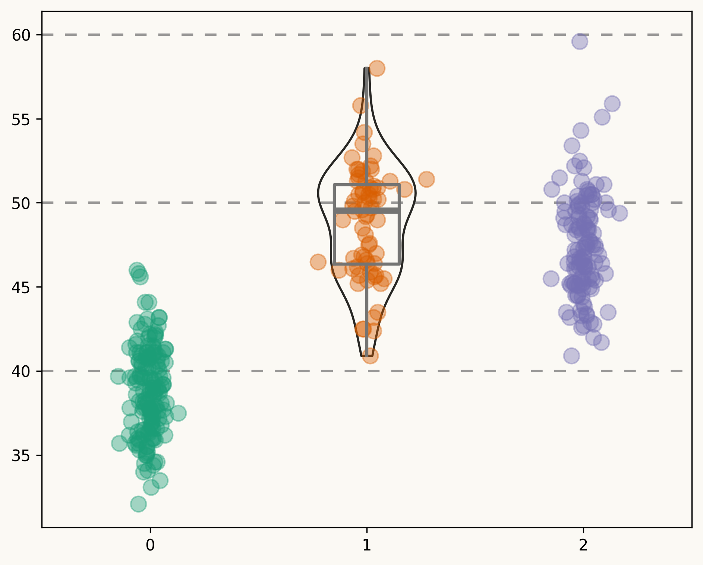

# Introduction

This is the analysis of Palmer penguins dataset. The dataset is available at [Palmer penguins](https://allisonhorst.github.io/palmerpenguins/). 1-2 lines about the dataset.

We will explore the dataset, clean it, and prepare it for analysis. The dataset contains information about penguins, including their species, island, bill length, bill depth, flipper length, body. for our sake we will focus on the species, island, bill length, bill depth, flipper length, and body mass. we will use pandas, plotly and seaborn to explore the dataset. We will also use numpy and scipy for statistical analysis.

# Load the dataset

```{python}
#| echo: true
#| eval: false
#| code-fold: true
import pandas as pd
import numpy as np
import seaborn as sns
import plotly.express as px
import matplotlib.pyplot as plt
import plotly.io as pio
import matplotlib.pyplot as plt
import scipy.stats as st

# Load the dataset
penguins = pd.read_csv("./data/penguins.csv")
penguins.head()
```

# Treating Missing Values
```{python}
#| echo: true
#| eval: false
#| code-fold: true
#| label: "missing-values"
#| fig-cap: "Missing values in the dataset"
#| fig-align: center
# Check for missing values
import missingno as msno

msno.matrix(penguins, figsize=(8.5, 5), fontsize=11)
```

Based on the above plot, we can see that there are some missing values in the `sex` column. We will drop the rows with missing values for this analysis.

## Drop rows with missing values
```{python}
#| echo: true
#| eval: false
#| code-fold: true
#| label: "drop-missing-values"
#| fig-cap: "Missing values after dropping rows"
#| fig-align: center
# Drop rows with missing values
penguins_cleaned = penguins.dropna()
# Check the shape of the cleaned dataset
penguins_cleaned.shape
# Check for missing values again
msno.matrix(penguins_cleaned, figsize=(8.5, 5), fontsize=11)

```

# Exploratory Data Visualization
The section belore explores the dataset using visualizations. We will use seaborn and plotly to create visualizations of the dataset. We will also use matplotlib to create custom visualizations. 

## Data Selection for Visualization

The plot below shows the distribution of bill length for each species of penguins. We will use seaborn to create a violin plot to visualize the distribution of bill length for each species.
```{python}
#| echo: true
#| eval: false
#| code-fold: true
# Get the species, sorted alphabetically
species = sorted(penguins["species"].unique())

# y_data is a list of length 3 containing the bill_length_mm values for each specie 
y_data = [penguins[penguins["species"] == specie]["bill_length_mm"].values for specie in species]

# Create jittered version of "x" (which is only 0, 1, and 2)
# More about this in the bonus track!
jitter = 0.04
x_data = [np.array([i] * len(d)) for i, d in enumerate(y_data)]
x_jittered = [x + st.t(df=6, scale=jitter).rvs(len(x)) for x in x_data]
```

```{python}
#| echo: true
#| eval: false
#| code-fold: true
#| label: "bill_length_species"
#| fig-cap: "Distribution of bill length for each species of penguins"


# Visualize the distribution of species
# Colors
BG_WHITE = "#fbf9f4"
GREY_LIGHT = "#b4aea9"
GREY50 = "#7F7F7F"
BLUE_DARK = "#1B2838"
BLUE = "#2a475e"
BLACK = "#282724"
GREY_DARK = "#747473"
RED_DARK = "#850e00"

# Colors taken from Dark2 palette in RColorBrewer R library
COLOR_SCALE = ["#1B9E77", "#D95F02", "#7570B3"]

# Horizontal positions for the violins. 
# They are arbitrary numbers. They could have been [-1, 0, 1] for example.
POSITIONS = [0, 1, 2]

# Horizontal lines
HLINES = [40, 50, 60]

fig, ax = plt.subplots(figsize= (7.5, 6))

# Some layout stuff ----------------------------------------------
# Background color
fig.patch.set_facecolor(BG_WHITE)
ax.set_facecolor(BG_WHITE)

# Horizontal lines that are used as scale reference
for h in HLINES:
    ax.axhline(h, color=GREY50, ls=(0, (5, 5)), alpha=0.8, zorder=0)

# Add violins ----------------------------------------------------
# bw_method="silverman" means the bandwidth of the kernel density
# estimator is computed via Silverman's rule of thumb. 
# More on this in the bonus track ;)

# The output is stored in 'violins', used to customize their appearence
violins = ax.violinplot(
    y_data, 
    positions=POSITIONS,
    widths=0.45,
    bw_method="silverman",
    showmeans=False, 
    showmedians=False,
    showextrema=False
);

# Customize violins (remove fill, customize line, etc.)
for pc in violins["bodies"]:
    pc.set_facecolor("none")
    pc.set_edgecolor(BLACK)
    pc.set_linewidth(1.4)
    pc.set_alpha(1)
    

# Add boxplots ---------------------------------------------------
# Note that properties about the median and the box are passed
# as dictionaries.

medianprops = dict(
    linewidth=4, 
    color=GREY_DARK,
    solid_capstyle="butt"
);
boxprops = dict(
    linewidth=2, 
    color=GREY_DARK
);

ax.boxplot(
    y_data,
    positions=POSITIONS, 
    showfliers = False, # Do not show the outliers beyond the caps.
    showcaps = False,   # Do not show the caps
    medianprops = medianprops,
    whiskerprops = boxprops,
    boxprops = boxprops
);

# Add jittered dots ----------------------------------------------
for x, y, color in zip(x_jittered, y_data, COLOR_SCALE):
    ax.scatter(x, y, s = 100, color=color, alpha=0.4);

fig.savefig("./output/figures/bill_length_species.png", 
    format="png", dpi=300, bbox_inches="tight")
```

{width=80%}


```{ojs}
//| panel: input
//| echo: false
viewof bill_length_min = Inputs.range(
  [32, 50], 
  {value: 35, step: 1, label: "Bill length (min):"}
)
viewof islands = Inputs.checkbox(
  ["Torgersen", "Biscoe", "Dream"], 
  { value: ["Torgersen", "Biscoe"], 
    label: "Islands:"
  }
)
```

::: {.panel-tabset}

## Plot

```{ojs}
Plot.rectY(filtered, 
  Plot.binX(
    {y: "count"}, 
    {x: "body_mass_g", fill: "species", thresholds: 20}
  ))
  .plot({
    facet: {
      data: filtered,
      x: "sex",
      y: "species",
      marginRight: 80
    },
    marks: [
      Plot.frame(),
    ]
  }
)
```

## Data

```{ojs}
Inputs.table(filtered)
```

:::

```{ojs}
data = FileAttachment("./data/penguins.csv").csv({ typed: true })
```

```{ojs}
filtered = data.filter(function(penguin) {
  return bill_length_min < penguin.bill_length_mm &&
         islands.includes(penguin.island);
})
```