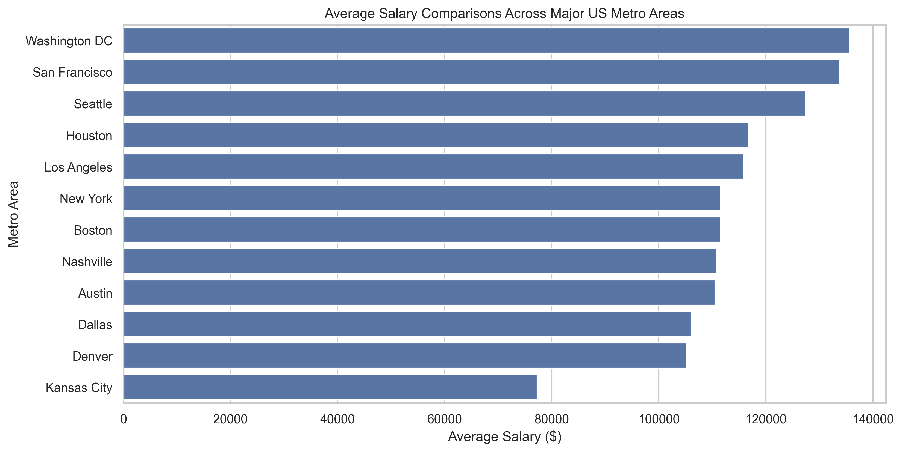

```{python}
#| echo: false
#| eval: false
from pyspark.sql import SparkSession

# Start a Spark session
spark = SparkSession.builder.appName("JobPostingsAnalysis").getOrCreate()

# Load the CSV file into a Spark DataFrame
df = spark.read.option("header", "true").option("inferSchema", "true").option("multiLine","true").option("escape", "\"").csv("./data/lightcast_job_postings.csv")

# Show schema
df.show(5, truncate=False)
```

# Metro Salary Comparison
{width="80%" fig-align="center"}